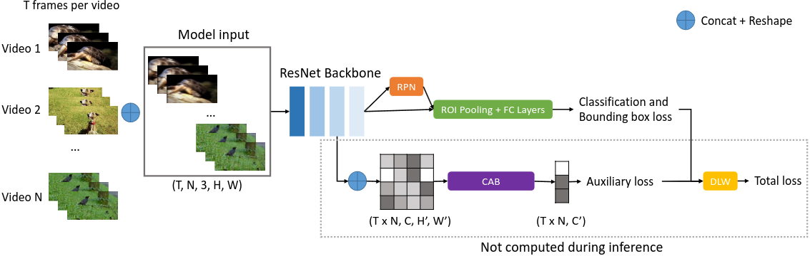

## Contrastive Learning through Auxiliary Branch for Video Object Detection
The official implementation of our ACIVS 2025 paper:
[Contrastive Learning through Auxiliary Branch for Video Object Detection](https://arxiv.org/abs/2508.20551).

#### Abstract
*Video object detection is a challenging task because videos often suffer from image deterioration such as motion blur, occlusion, and deformable shapes, making it significantly more difficult than detecting objects in still images. Prior approaches have improved video object detection performance by employing feature aggregation and complex post-processing techniques, though at the cost of increased computational demands. To improve robustness to image degradation without additional computational load during inference, we introduce a straightforward yet effective Contrastive Learning through Auxiliary Branch (CLAB) method. First, we implement a constrastive auxiliary branch using a contrastive loss to enhance the feature representation capability of the video object detector’s backbone. Next, we propose a dynamic loss weighting strategy that emphasizes auxiliary feature learning early in training while gradually prioritizing the detection task as training converges. We validate our approach through comprehensive experiments and ablation studies, demonstrating consistent performance gains. Without bells and whistles, CLAB reaches a performance of 84.0% mAP and 85.2% mAP with ResNet-101 and ResNeXt-101, respectively, on the ImageNet VID dataset, thus achieving state-of-the-art performance for CNN-based models without requiring additional post-processing methods.*



### Install
Please first install the required dependencies. This can be done by:
```
pip install mmcv-full==1.7.1 -f https://download.openmmlab.com/mmcv/dist/cu116/torch1.11/index.html
pip install yapf==0.40.1
pip install mmdet==2.28.2
pip install pytorch-metric-learning
pip install tensorboard
pip install -r requirements/build.txt
pip install -v -e .
```

### Training
```
./tools/dist_train.sh configs/vid/temporal_roi_align/selsa_troialign_faster_rcnn_r101_dc5_7e_imagenetvid.py 8
```
### Evaluation
```
python tools/test.py configs/vid/temporal_roi_align/selsa_troialign_faster_rcnn_r101_dc5_7e_imagenetvid.py --checkpoint work_dirs/selsa_troialign_faster_rcnn_r101_dc5_7e_imagenetvid/epoch_7.pth --eval bbox --work-dir work_dirs/selsa_troialign_faster_rcnn_r101_dc5_7e_imagenetvid

```

### Cite
If you found this work useful in your research, please consider citing:
```
@article{rakotoarivony2025contrastive,
  title={Contrastive Learning through Auxiliary Branch for Video Object Detection},
  author={Rakotoarivony, Lucas},
  journal={arXiv preprint arXiv:2508.20551},
  year={2025}
}
```

### Acknowledgement

Part of the code is modified from [mmtracking](https://github.com/open-mmlab/mmtracking) repo.

